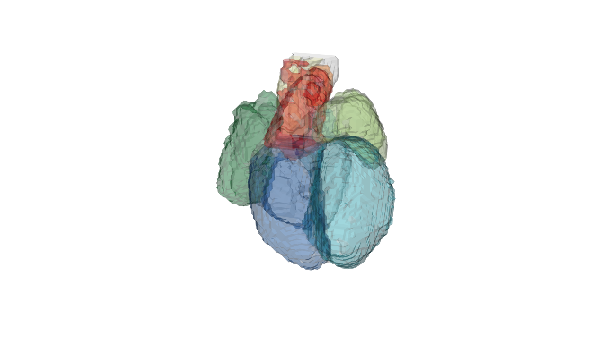
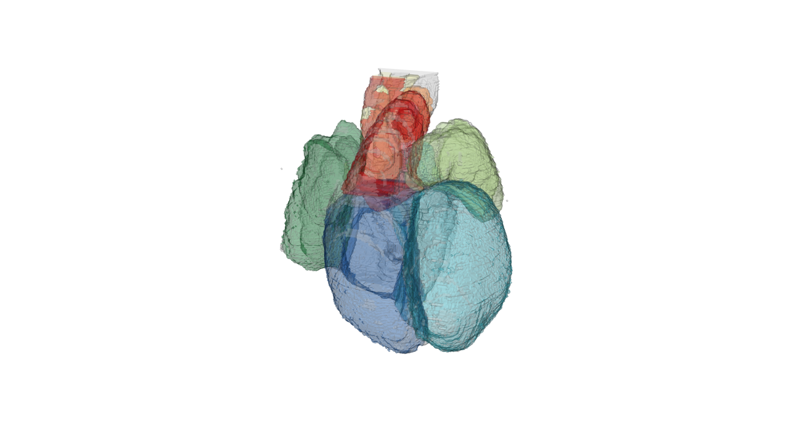
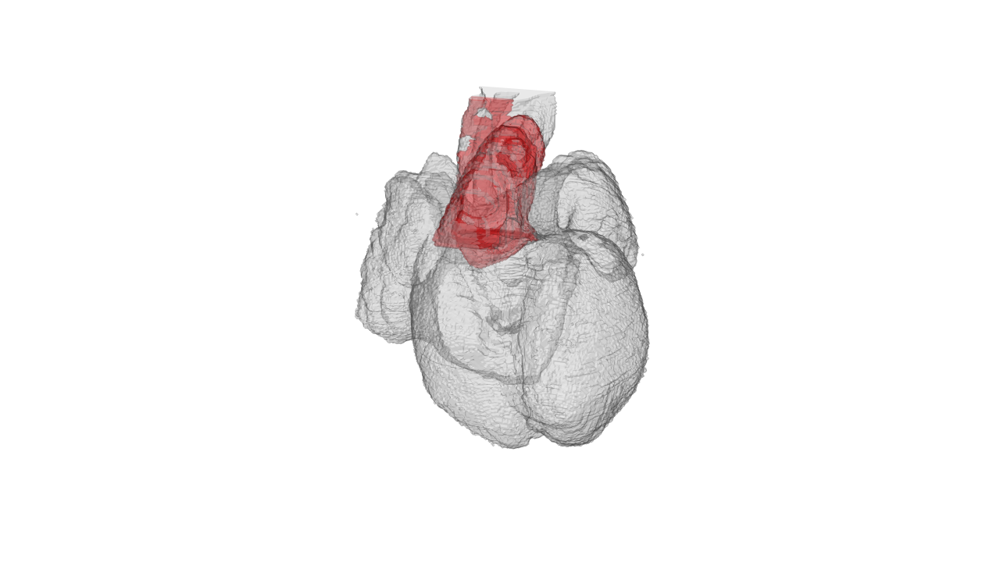
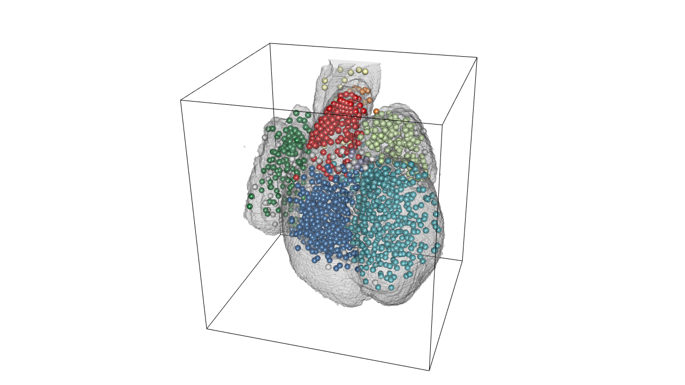
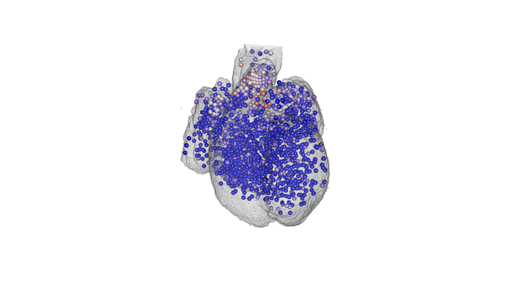

Spatial transcriptomics high-level 3D data analysis
================

Description of the data
-----------------------

Begin by loading the pre-processed data:

``` r
load('./data/ST_heart_27032018.RData')
```

Lets see what it contains:

``` r
names(heart)
```

    ## [1] "atlas" "genes"

There are two data frames one with the RNAseq data and one with the atlas data. Every row is a spot and the two data frames are matched so `heart$atlas[123,]` is the same spot as `heart$genes[123,]`.

``` r
head(heart$atlas)
```

    ##            x        y intensity  area id   color  color2 acronym
    ## 537 17044.09 14752.31         0 31934 17 #0B61A4    <NA>      LV
    ## 550 15557.39 14725.60         0 30502 17 #0B61A4 #41b6c4      LV
    ## 556 16338.52 14749.41         0 36820 17 #0B61A4 #41b6c4      LV
    ## 565 17027.89 14057.10         0 32274 17 #0B61A4 #41b6c4      LV
    ## 566 14857.41 14019.45         0 20654 17 #0B61A4 #41b6c4      LV
    ## 570 19129.29 14026.82         0 33556 19 #FF4900    <NA>      RV
    ##                name right.left rostral.caudal anterior.posterior spot.id
    ## 537 right ventricle  171.67656       486.1625                192     537
    ## 550 right ventricle   87.43070       447.6606                192     550
    ## 556 right ventricle  132.92846       471.6618                192     556
    ## 565 right ventricle  177.67626       451.1608                192     565
    ## 566 right ventricle   32.18342       373.6570                192     566
    ## 570  left ventricle  290.67070       462.4113                192     570
    ##     nuclei        image spot.pos
    ## 537     30 1_CN73_E1_HE    15x16
    ## 550     34 1_CN73_E1_HE    17x16
    ## 556     38 1_CN73_E1_HE    16x16
    ## 565     28 1_CN73_E1_HE    15x17
    ## 566     20 1_CN73_E1_HE    18x17
    ## 570     20 1_CN73_E1_HE    12x17

``` r
heart$genes[1:10,1:4]
```

    ##       ENSG00000000003 ENSG00000000419 ENSG00000001036 ENSG00000001167
    ## 15x16               0               0               0               0
    ## 17x16               0               0               0               0
    ## 16x16               0               0               1               0
    ## 15x17               0               0               0               0
    ## 18x17               0               1               0               0
    ## 12x17               0               0               1               0
    ## 14x17               0               0               0               0
    ## 17x17               0               1               0               0
    ## 16x17               0               0               0               0
    ## 13x17               0               0               1               0

So lets explain the variables in `heart$atlas`:

``` r
names(heart$atlas)
```

    ##  [1] "x"                  "y"                  "intensity"         
    ##  [4] "area"               "id"                 "color"             
    ##  [7] "color2"             "acronym"            "name"              
    ## [10] "right.left"         "rostral.caudal"     "anterior.posterior"
    ## [13] "spot.id"            "nuclei"             "image"             
    ## [16] "spot.pos"

| Variable             | Explanation                                              |
|:---------------------|:---------------------------------------------------------|
| `x`                  | X centroid of spot in original pixel image               |
| `y`                  | Y centroid of spot in original pixel image               |
| `intensity`          | not really used here.                                    |
| `area`               | area in pixels of spot.                                  |
| `id`                 | unique integer value for the region the spot is in.      |
| `color`              | hex color code for the region the spot is in.            |
| `color2`             | Color code corrected for spots that couldn't be assigned |
| `acronym`            | region acronym for where the spot is in.                 |
| `name`               | region name for where the spot is in.                    |
| `right.left`         | X coordinate in pixels of the reference atlas            |
| `rostral.caudal`     | Y coordinate in pixels of the reference atlas.           |
| `anterior.posterior` | Z oordinate in pixels of the reference atlas             |
| `spot.id`            | just `1:now(heart$atlas)`                                |
| `nuclei`             | number of nuclei in spot                                 |
| `image`              | The image the spots came from                            |
| `spot.pos`           | The array position of the spot in 33x35                  |

3D heart plot using RGL
-----------------------

RGL is a package that uses OpPenGL as backend for 3D visualization in R. misc3d is a package that we will use for drawing scenes in 3d.

``` r
library(rgl)
library(misc3d)
```

Load the 3D volume heart atlas.

``` r
load('./data/heart.RData')
```

We begin by defining the perspective we want to plot from (this doesn't have to make sense now I'll show later how to get these parameters):

``` r
perspective<-list(FOV = 30, ignoreExtent = FALSE, listeners = 1L, 
    mouseMode = structure(c("trackball", "zoom", "fov", "pull"
    ), .Names = c("left", "right", "middle", "wheel")), skipRedraw = FALSE, 
    userMatrix = structure(c(-0.0108720660209656, 0.899227440357208, 
    0.437346190214157, 0, 0.955604612827301, -0.119448974728584, 
    0.269354522228241, 0, 0.2944515645504, 0.420858442783356, 
    -0.858007192611694, 0, 0, 0, 0, 1), .Dim = c(4L, 4L)), scale = c(1, 
    1, 1), viewport = structure(c(0L, 0L, 1280L, 720L), .Names = c("x", 
    "y", "width", "height")), zoom = 1, windowRect = c(0L, 45L, 
    1280L, 765L), family = "sans", font = 1L, cex = 1, useFreeType = TRUE)
```

Lets plot the entire heart and then regions outlines.

``` r
#open 3D plot window
open3d(windowRect = c(0, 0, 1280, 720))
#use the perspective
par3d(perspective)
#draw low-resolution heart with color coding
drawScene.rgl(organ.dwnsmp[which(names(organ.dwnsmp)%in%c('WH',  'RA', 'RV', 'LA', 'LV', 'P', 'A', 'OT'))])
rgl.snapshot(file='./images/lowresolution.png')
```

 This is a low resolution of the heart that you can rotate and zoom in with the ouse in realtime.

If you have rotated the heart and want to save the perspective parameters into a R object to use later simply run:

``` r
pp<- par3d(no.readonly = TRUE)
```

And the parameters are now saved into `pp` and you can set the perspective in the 3D plot by `par3d(pp)` before plotting with `drawScene.rgl()`.

For more high resolution rendering you set the position you want of the heart and then rerun the code but not using the `organ.dwnsmp` but `organ` instead.

``` r
drawScene.rgl(organ[which(names(organ.dwnsmp)%in%c('WH',  'RA', 'RV', 'LA', 'LV', 'P', 'A', 'OT'))])
rgl.snapshot(file='./images/highresolution.png')
```



You can select which region to highlight by setting the acronyms in the character vector. here I show `WH` whole heart as well as `OT` outflow tract:

``` r
drawScene.rgl(organ[which(names(organ.dwnsmp)%in%c('WH','OT'))])
rgl.snapshot(file='./images/OT_highlight.png')
```



Lets plot all the spots with the color according to their anatomical region:

``` r
#draw all the spots with region color
drawScene.rgl(organ[which(names(organ.dwnsmp)%in%c('WH'))])
radius.of.spots.in.atlas.pixels<- (100/(2383.36/532))/3
spheres3d(598-heart$atlas$rostral.caudal, 532-heart$atlas$right.left, heart$atlas$anterior.posterior, col=heart$atlas$color2, radius=radius.of.spots.in.atlas.pixels)
#bounding box
box3d()
rgl.snapshot(filename='./images/3d_heart_spots.png')
```



Changeing colors depending on region can easily be done like this:

``` r
#create a matching index with regions accoridng to the order you want to change color
matching.index <- match(heart$atlas$acronym, c('RA', 'LA', 'RV', 'LV', 'P', 'A', 'OT', 'epc'))
#overwrite with the color vector
heart$atlas$color2[!is.na(matching.index)] <- c('#c2e699', "#238443", '#41b6c4', '#225ea8', '#ffffb2', "#fd8d3c", '#e31a1c', '#9e9ac8')[na.omit(matching.index)]
```

Finally lets plot the gene expression of specific spots:

``` r
#plot gene of interest OGN
gene.of.interest<-heart$genes[,which(colnames(heart$genes)=='ENSG00000106809')]

#color ramp palette base don gene expression
PaletteFunction <- colorRampPalette(c("blue", "white", "red"), space = "Lab")
gene.expression<-PaletteFunction(100)[as.numeric(cut(scale(log2(gene.of.interest+1)), breaks = 100))]

drawScene.rgl(organ[which(names(organ.dwnsmp)%in%c('WH'))])

spheres3d(598-heart$atlas$rostral.caudal, 532-heart$atlas$right.left, heart$atlas$anterior.posterior, col=gene.expression, radius=radius.of.spots.in.atlas.pixels )
rgl.snapshot(filename='./images/OGN_3d_heart.png')
```


